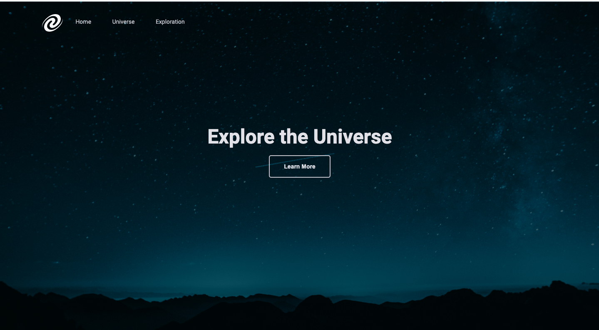

<h1 align="center"> SPA Universe </h1>

  <a href="#-tecnologias">Technology</a>&nbsp;&nbsp;&nbsp;|&nbsp;&nbsp;&nbsp;
  <a href="#-projeto">Project</a>&nbsp;&nbsp;&nbsp;|&nbsp;&nbsp;&nbsp;
  <a href="#-layout">Layout</a>&nbsp;&nbsp;&nbsp;|&nbsp;&nbsp;&nbsp;
  <a href="#memo-licença">License</a>

 

<h2 align="center"> Design </h2>

  

## 🚀 Technology

This project was developed with the technologies below:

- HTML and CSS
- Git and Github
- JavaScript

## 💻 Project

This was a challenge created by Rocketseat's course, which aims to create a Single Page Application using JavaScript as the main tool.

The technologies used in this application are listed below:

- Single Page Aplication - SPA;
- Route mapping;
- Asynchronism and promises;
- Object-oriented programming;
- Classes

  

## :memo: License

This project is above the MIT license.

## link

<a href="https://gustavozonta.github.io/SPAuniverse/" target="_blank"> SPA Universe</a>

---

 Made  ♥  by Gustavo Zonta
